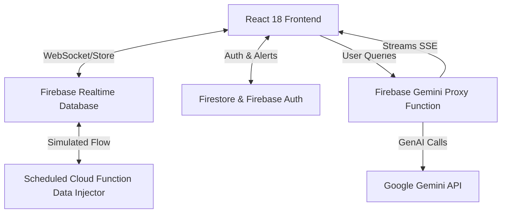

# Roarboard — Smart Venue Experience Platform

Welcome to the repository for **Roarboard**, built for the Google "Build with AI" Hackathon!

## Chosen Vertical
Physical Event Experience at Sporting Venues.

## Problem Being Solved
Large-scale sporting events often experience massive, unpredictable crowds that create dangerous bottlenecks at entry gates, concession stands, and restrooms. Attendees lack real-time visibility into the fastest routes and wait times, leading to frustration and missed event moments. Venue staff equally lack a unified, AI-powered overview to dynamically triage crowd clustering and proactively broadcast life-saving alerts before crushes happen. Roarboard solves this by offering a dual-sided, real-time map and smart AI companion for attendees alongside an authoritative command dashboard for staff.

## How it Works
**Attendee Flow:**
1. A fan opens the app and is instantly, frictionlessly authenticated anonymously.
2. They view a live venue heatmap and a sorted gate board displaying real-time wait times dynamically sourced from Firebase.
3. If they require assistance, they tap the AI Assistant, which streams AI answers instantly regarding optimal routing or food stand waits, strictly contextualised by live venue backend data.
4. If a threshold is crossed, they receive real-time Push Notifications informing them of congestion.

**Staff Flow:**
1. A staff member navigates to `/staff` and securely logs in using Google Sign-In, safeguarded by custom Admin claims.
2. They view live analytics comparing sector density over the last 60 minutes via Google Charts.
3. They use the intuitive Broadcast Dashboard to publish unified notifications directly to attendees across the venue instantly.

## Architecture Diagram


## Google Services Used
- **Google Gemini API**: Powers the intelligent, context-aware AI Assistant.
- **Google Maps JavaScript API**: Renders the immersive, dark-themed interactive stadium map.
- **Firebase Realtime Database**: Streams fast, live payload updates for the gate waits and ticker.
- **Cloud Firestore**: Stores rate limits, user settings, and staff action notifications.
- **Firebase Authentication**: Manages Anonymous zero-friction logins and Google OAuth SSO.
- **Firebase Cloud Functions (Gen2)**: Proxies AI logic secretly and simulates live metric flow.
- **Firebase Cloud Messaging**: Dispatches critical push notifications to devices.
- **Google Analytics 4**: Tracks conversion and query volume automatically.
- **Firebase Performance Monitoring**: Analyses render logic and streaming latency speeds.
- **Google Charts API**: Generates insightful line and bar analytic panels for staff.

## Local Setup
```bash
git clone <repository_url>
cd roarboard
cp .env.example .env
npm install
npm run dev
```

## Environment Variables
Ensure the following variables are configured in your `.env` (no sensitive keys are committed):
| Variable | Purpose |
|----------|---------|
| `VITE_FIREBASE_API_KEY` | Connects React to Firebase Auth & DB. |
| `VITE_FIREBASE_AUTH_DOMAIN` | Firebase OAuth Domain setup. |
| `VITE_FIREBASE_PROJECT_ID` | Project Identifier boundary. |
| `VITE_FIREBASE_DATABASE_URL` | Root endpoint for the WebSocket DB. |
| `VITE_GOOGLE_MAPS_API_KEY` | Loads interactive map tiles safely. |

*Note: For the backend Cloud Function bridging, `GEMINI_API_KEY` must be saved in Firebase Secrets/Environment.*

## Testing
Comprehensive suites cover logic and end-to-end rendering loops.
```bash
# Run unit and integration tests (Vitest + React Testing Library)
npm run test

# Run End-to-End flow tests (Playwright)
npm run test:e2e
```

## Assumptions Made
- The real-world venue sensors (turnstiles, cameras) are piped correctly to update the Realtime Database. For this MVP, a cron-based Cloud Function simulates realistic live data flow.
- The conceptual demo maps "Eden Gardens" scale zones but uses mock SVG bounds to maintain frontend agility over heavy tile layers inside the Heatmap view.

## Accessibility
Roarboard strictly conforms to WCAG 2.1 AA parameters. Significant considerations include enforcing a minimum color contrast of 4.5:1, deep DOM support for screen readers via `aria-live` elements, motion reduction wrappers mapping to OS `prefers-reduced-motion` settings, and total keyboard navigability without mouse reliance.
